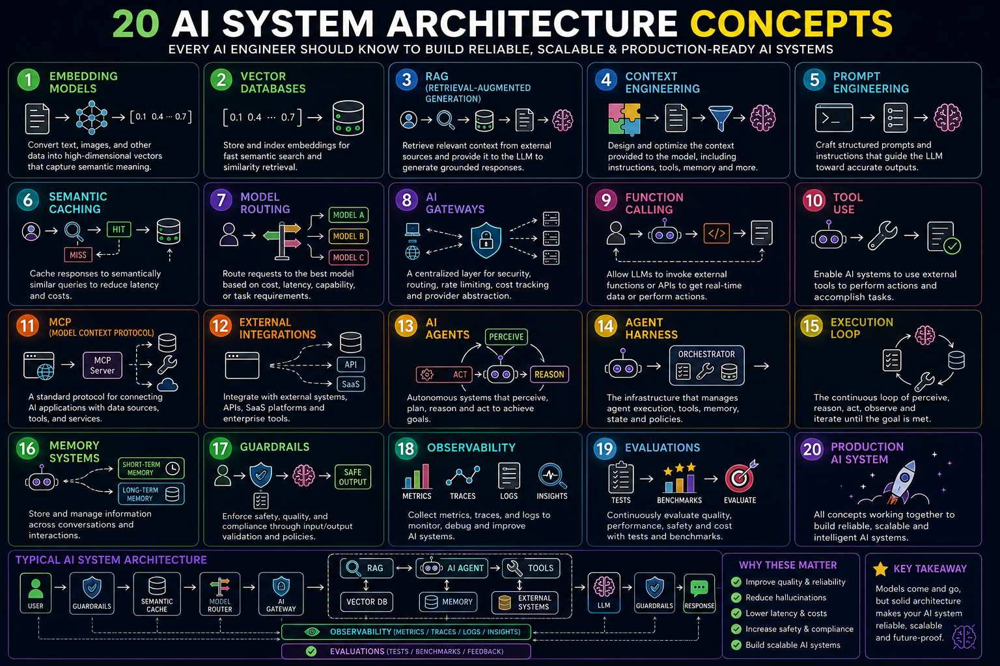

# 🧠 20 AI System Architecture Concepts Every AI Engineer Should Know

Knowing how to call an LLM API is table stakes now.

What separates AI applications that hold up in production from ones that quietly degrade is the architecture around the model.

Modern AI systems are not just:

    User → LLM → Answer

They are complete systems involving retrieval, memory, routing, tools, agents, evaluation, observability, and safety.

---

# 1️⃣ Embedding Models

Convert text, images, code, and other data into high-dimensional vectors that capture semantic meaning.

Similar concepts land close together in vector space.

This is the foundation of semantic search and modern retrieval systems.

---

# 2️⃣ Vector Databases

Store and index embeddings for fast semantic search and retrieval.

They allow AI systems to find information based on meaning rather than simple keyword matching.

---

# 3️⃣ RAG — Retrieval-Augmented Generation

User Query
    ↓
Retrieve Relevant Context
    ↓
Vector Database
    ↓
LLM
    ↓
Grounded Answer

RAG retrieves relevant information from external knowledge sources and provides it to the LLM as context.

This helps reduce hallucinations and keeps responses grounded in real data.

---

# 4️⃣ Context Engineering

Designing, managing, and optimizing the complete context provided to an AI model.

Context engineering includes:

- Retrieved documents
- Conversation history
- System instructions
- Tool results
- User information
- Memory
- Agent state

The quality of the context often matters more than the size of the prompt.

---

# 5️⃣ Prompt Engineering

Designing structured instructions that guide LLMs toward accurate, relevant, and consistent responses.

Prompt engineering focuses on how to communicate effectively with the model.

Context engineering focuses on everything that goes into the model's context.

---

# 6️⃣ Semantic Caching

Caches responses to semantically similar queries.

User Query
    ↓
Semantic Similarity Search
    ↓
Cache Hit → Return Cached Response
    ↓
Cache Miss → Call LLM

Semantic caching can significantly reduce:

- ⚡ Latency
- 💰 LLM costs
- 🔥 Infrastructure load

---

# 7️⃣ Model Routing

Routes different requests to different models based on:

- Complexity
- Cost
- Latency
- Quality requirements
- Task type

Example:

Simple Query → Small/Fast Model

Complex Reasoning → Large Model

Code Generation → Specialized Model

Model routing helps balance quality, cost, and performance.

---

# 8️⃣ AI Gateways

A centralized layer between AI applications and model providers.

An AI Gateway can provide:

- Model routing
- Rate limiting
- Authentication
- Logging
- Cost tracking
- Failover
- Provider abstraction

Instead of connecting directly to multiple providers, applications can communicate through one controlled gateway.

---

# 9️⃣ Function Calling

Allows an LLM to invoke external functions and APIs.

User Query
    ↓
LLM
    ↓
Function Call
    ↓
External API / Tool
    ↓
Function Response
    ↓
LLM
    ↓
Final Answer

This turns an LLM from a text generator into a system that can interact with the real world.

---

# 🔟 Tool Use

Tools allow AI systems to perform actions.

Examples include:

- 🔍 Search
- 🧮 Calculators
- 🗄️ Databases
- 🐍 Python execution
- 🌐 APIs
- 📁 File systems
- 🖥️ Browsers

Function calling is one mechanism for invoking tools.

Tool use is the broader capability of an AI system to interact with external capabilities.

---

# 1️⃣1️⃣ MCP — Model Context Protocol

A standard protocol for connecting AI applications with:

- 📊 Data sources
- 🛠️ Tools
- ☁️ Services
- 🔌 APIs

MCP provides a standardized way for AI applications to discover and use external capabilities.

Think of it as a universal connector for AI systems.

---

# 1️⃣2️⃣ External Integrations

AI systems rarely operate alone.

They often connect to:

- Databases
- SaaS platforms
- CRMs
- Payment systems
- Cloud services
- Internal APIs
- Enterprise systems

External integrations allow AI systems to operate inside real business workflows.

---

# 1️⃣3️⃣ AI Agents

An AI agent is an autonomous system that can:

- Perceive
- Reason
- Plan
- Use tools
- Maintain memory
- Take actions

A simple agent:

Goal
 ↓
Perception
 ↓
Reasoning
 ↓
Planning
 ↓
Action

An agent is more than a single LLM call.

---

# 1️⃣4️⃣ Agent Harness

The agent harness is the infrastructure surrounding the model that enables reliable agent execution.

It can manage:

- Tool access
- Permissions
- State
- Memory
- Context
- Retries
- Timeouts
- Execution limits
- Agent policies

The LLM provides reasoning.

The harness provides the environment in which the agent operates.

---

# 1️⃣5️⃣ Execution Loop

Most agents operate through an execution loop:

Perceive
    ↓
Reason
    ↓
Act
    ↓
Observe Result
    ↓
Repeat

The loop continues until:

- The goal is achieved
- The agent reaches a stopping condition
- A human takes control
- A safety policy blocks execution

This loop is the core of many agentic systems.

---

# 1️⃣6️⃣ Memory Systems

AI systems can use different types of memory.

Short-Term Memory
    ↓
Current Conversation
    ↓
Long-Term Memory
    ↓
Persistent User / Knowledge Information

Memory systems allow AI applications to maintain information across interactions.

Common types include:

- 🧠 Conversation memory
- 📚 Semantic memory
- 🗃️ Long-term memory
- ⚙️ Working memory

---

# 1️⃣7️⃣ Guardrails

Guardrails enforce safety, quality, and policy requirements.

They can validate:

- User inputs
- Model outputs
- Tool calls
- Data access
- Agent actions

Typical flow:

User Input
    ↓
Input Guardrails
    ↓
AI System
    ↓
Output Guardrails
    ↓
Safe Output

Guardrails are the layer between your AI system and the things that break user trust.

---

# 1️⃣8️⃣ Observability

You cannot operate production AI systems without knowing what is happening inside them.

AI observability includes:

- 📊 Metrics
- 🔗 Traces
- 📝 Logs
- 🔍 Insights

You need to answer questions like:

- How long did the request take?
- Which model was used?
- How many tokens were consumed?
- Which tools were called?
- Where did the agent fail?
- How much did the request cost?

If you cannot observe your AI system, you cannot reliably improve it.

---

# 1️⃣9️⃣ Evaluations

AI systems must be continuously evaluated.

Evaluation can include:

- 🧪 Tests
- 📊 Benchmarks
- 🎯 Quality evaluation
- 📈 Regression testing
- 👥 Human feedback

The goal is to measure whether the system is actually improving.

What cannot be measured cannot be reliably improved.

---

# 2️⃣0️⃣ Production AI Architecture

Modern AI systems combine many of these concepts:

                         ┌─────────────────┐
                         │   User Query    │
                         └────────┬────────┘
                                  │
                                  ▼
                         ┌─────────────────┐
                         │    Guardrails   │
                         └────────┬────────┘
                                  │
                                  ▼
                         ┌─────────────────┐
                         │ Semantic Cache  │
                         └────────┬────────┘
                                  │
                         ┌────────┴────────┐
                         │                 │
                        HIT               MISS
                         │                 │
                         ▼                 ▼
                   Cached Answer    ┌───────────────┐
                                    │ Model Router  │
                                    └───────┬───────┘
                                            │
                                            ▼
                                    ┌───────────────┐
                                    │  AI Gateway   │
                                    └───────┬───────┘
                                            │
                                            ▼
                                    ┌───────────────┐
                                    │  Agent        │
                                    │  Harness      │
                                    └───────┬───────┘
                                            │
                              ┌─────────────┴─────────────┐
                              │                           │
                              ▼                           ▼
                       RAG Retrieval                Tool Use
                              │                           │
                              ▼                           ▼
                       Vector Database             External APIs
                              │                           │
                              └─────────────┬─────────────┘
                                            │
                                            ▼
                                    ┌───────────────┐
                                    │      LLM      │
                                    └───────┬───────┘
                                            │
                                            ▼
                                    ┌───────────────┐
                                    │    Memory     │
                                    └───────┬───────┘
                                            │
                                            ▼
                                    ┌───────────────┐
                                    │  Guardrails   │
                                    └───────┬───────┘
                                            │
                                            ▼
                                    ┌───────────────┐
                                    │    Response   │
                                    └───────────────┘

                    ┌─────────────────────────────┐
                    │       OBSERVABILITY         │
                    │  Metrics · Traces · Logs    │
                    └─────────────────────────────┘

                    ┌─────────────────────────────┐
                    │         EVALUATIONS         │
                    │   Tests · Benchmarks · QA   │
                    └─────────────────────────────┘

---

# 🎯 Final Thought

**Know the concepts. Understand the architecture. Build systems that last.**

The LLM is only one component.

The real engineering challenge is building everything around it:

- Context
- Retrieval
- Memory
- Tools
- Agents
- Routing
- Integrations
- Safety
- Observability
- Evaluation

The future of AI engineering is not just about calling models.

It is about building reliable intelligent systems.

---

⭐ If you find my work interesting, feel free to explore my repositories and connect with me.
